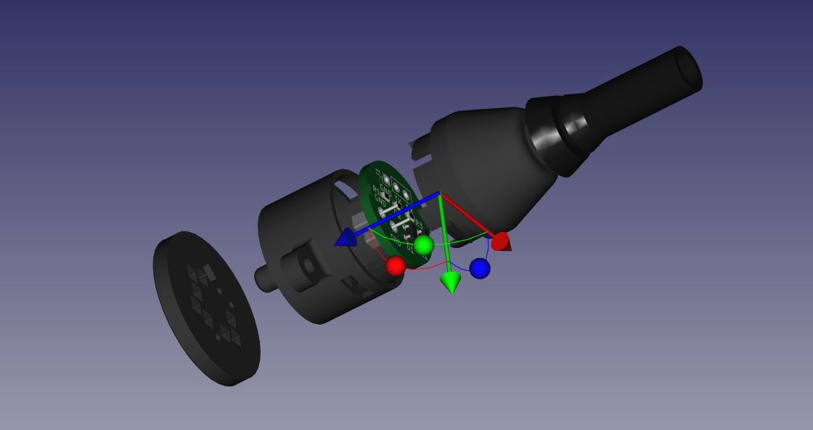

# tk-x90-mic-connector-housing

This is a microphone connector housing for the Kenwood TK-x90 series radios.
This housing can be used to create a microphone connector or a programmer
for the Kenwood TK-690, TK-790 and TK-890 radios.  The components are designed
to be 3D printed.

 
This work is licensed under a
<a rel="license" href="http://creativecommons.org/licenses/by-sa/4.0/">
Creative Commons Attribution-ShareAlike 4.0 International License</a>.

## Description

This is a multi-part assembly which is intended to be used with the KiCAD
projects for the microphone connector PCB or programmer PCB.

There are 4 components to the housing, excluding the PCBs.

 1. The base: this interfaces directly with the radio and includings a
    locating pin and M2.5 screw hole.  The PCB sits inside the base and
    forms the connector contacts.
 1. The body: this encloses the PCB inside the base and holds it in place.
    There is a snap-fit connection between the base and body.
 1. The boot: this is a strain-relief that fits inside the body.  It is
    designed to be printed in a flexible material such as NinjaFlex.
 1. The jig: this is a tool used to align the Mill Max components which
    are used as connector terminals.  These must be precisely aligned when
    the PCB is assembled to ensure it will fit in the base.

## Printing

The base, body and jig are designed to be printed out of high-temperature
materials, such as PETG, ABS or ASA.  For a microphone connector that will
be left in a vehicle for extended periods of time, I recommend printing in
ASA for durability, heat and UV resistance.

The boot must be printed in a strong, flexible material.  I used NinjaFlex
in the design and prototypes.  This worked extremely well.

The parts have very tight tolerances.  When printing the parts, material
shrinkage must be accounted for when slicing.

There are tall, narrow parts in the design which are prone to stringing if
the printer is not properly calibrated.  Active cooling is recommended when
printing the base, body and the boot.

The base should be printed with the pin up.  The body should be printed
with the widest part up.

The base will require supports and the area that is supported will need to
be cleaned up well to remove any material which might prevent the PCB from
sitting flat on the base.

## Assembly

Remove any support material that may exist inside the cutout area of the
flexible boot.  Remove the support material from the base.

Slide the flexible boot into the body.  Use pliers to pull the boot all the
way through the hole until the boot locks in place on the body.  The slot on
the neck of the boot will mate with the lip on the end of the body.  This may
require considerable force, but NinjaFlex can handle it.

Slide the body and boot onto the cable you will be using to construct the
microphone or programmer.  The boot should just fit around Cat 5 network
cable.  You may want to add some shrink tubing to the microphone cable to
increase the outer diameter a little bit.

Use the alignment jig to hold the Mill Max parts in place when soldering the
microphone connector PCB and when attaching the two contact headers to the
programmer PCB.

Before connecting any wires to the PCB, verify that it fits into the base.

Remove the PCB from the alignment jig.

Ensure that the PCB edges are free of any burrs or [mouse bites](https://www.allpcb.com/mouse_bites_pcb.html).
These must be filed off if they exist.  There is less than 0.5mm tolerance
between the edge of the PCB and the walls of the connector base.

Align the PCB with base using the two internal guide rails.  The PCB will
only fit in one way when the Mill Max connectors are soldered in place.

Verify that the ends of the Mill Max components are flush with the base
when the PCB is inserted.  Remove any material on the base, such as left-over
support material, which prevents the PCB from fully seating in the base.

Remove the PCB from the base.

When building the microphone PCB re-insert the PCB into the alignment jig.

Verify that the body and boot are on the cable.

Solder the wires to the PCB.  For the programmer, these are attached to the
through-hole connectors on the PCB.  You will need to trim the back side
fairly close to the PCB.  For the microphone, these go into the solder
cups of the Mill Max components.

Test connectivity before assembling the connector.

For the microphone, you can use a zip tie around the end of the outer cable
insulation to provide additional strain relief for the cable.

Slide the PCB into the base and slide the body and boot over the cable.

Align the tabs on the body with the cut-outs on the base and press the
two together until they snap in place.

